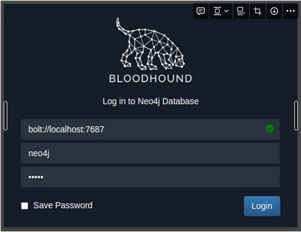

# Active Directory Attacks: Enumeration

# Enumerating Active Directory

> *"If you know the enemy and know yourself, you need not fear the results of a hundred battles. If you know yourself but not the enemy, for every victory gained you will also suffer defeat."* - Sun Tzu, Art of War.
> 

### **Objectives of AD Enumeration**

1. Initial Recon
2. Initial Compromise
3. Foothold
4. Escalate Privileges
5. Internal Recon
6. Lateral Pivot
7. Persistence
8. Escalate Privileges
9. Objectives met?
    - No.
        - Return to step 5
    - Yes.
        - Complete mission

### Credential Injection

Needs Windows machine and run CMD prompt with administrator privileges to execute the below command.

```powershell
runas.exe /netonly /user:<domain>\<username> cmd.exe
```

- **/netonly** - Since we are not domain-joined, we want to load the credentials for network authentication but not authenticate against a domain controller. So commands executed locally on the computer will run in the context of your standard Windows account, but any network connections will occur using the account specified here.
- **/user** - Here, we provide the details of the domain and the username. It is always a safe bet to use the Fully Qualified Domain Name (FQDN) instead of just the NetBIOS name of the domain since this will help with resolution.
- **cmd.exe** - This is the program we want to execute once the credentials are injected. This can be changed to anything, but the safest bet is cmd.exe since you can then use that to launch whatever you want, with the credentials injected.

```powershell
$dnsip = "<DC IP>"
$index = Get-NetAdapter -Name 'Ethernet' | Select-Object -ExpandProperty 'ifIndex'
Set-DnsClientServerAddress -InterfaceIndex $index -ServerAddresses $dnsip
```

**dir \\za.tryhackme.com\SYSVOL\**

**Question:** *Is there a difference between **`dir \\za.tryhackme.com\SYSVOL`** and **`dir \\<DC IP>\SYSVOL`** and why the big fuss about DNS?*

There is quite a difference, and it boils down to the authentication method being used. When we provide the hostname, network authentication will attempt first to perform Kerberos authentication. Since Kerberos authentication uses hostnames embedded in the tickets, if we provide the IP instead, we can force the authentication type to be NTLM. While on the surface, this does not matter to us right now, it is good to understand these slight differences since they can allow you to remain more stealthy during a Red team assessment. In some instances, organisations will be monitoring for OverPass- and Pass-The-Hash Attacks. Forcing NTLM authentication is a good trick to have in the book to avoid detection in these cases.

### Enumeration through **Microsoft Management Console**

MMC

### Enumeration through Command Prompt

**Users**

**net user /domain**

net user username /domain

**Groups**

net group /domain

net group groupname /domain

**Password Policy**

net accounts /domain

- Length of password history kept. Meaning how many unique passwords must the user provide before they can reuse an old password.
- The **lockout threshold** for incorrect password attempts and for how long the account will be locked.
- The minimum length of the password.
- The maximum age that passwords are allowed to reach indicating if passwords have to be rotated at a regular interval.

```powershell
***NET commands***
ACCOUNTS
COMPUTER
CONFIG
CONTINUE
FILE
GROUP
HELP
HELPMSG
LOCALGROUP
NAME
PAUSE
PRINT
SEND
SESSION
SHARE
START
STATISTICS
STOP
TIME
USE
USER
VIEW
```

**Benefits**

- No additional or external tooling is required, and these simple commands are often not monitored for by the Blue team.
- We do not need a GUI to do this enumeration.
- VBScript and other macro languages that are often used for phishing payloads support these commands natively so they can be used to enumerate initial information regarding the AD domain before more specific payloads are crafted.

**Drawbacks**

- The **`net`** commands must be executed from a domain-joined machine. If the machine is not domain-joined, it will default to the WORKGROUP domain.
- The **`net`** commands may not show all information. For example, if a user is a member of more than ten groups, not all of these groups will be shown in the output.

### Eunmeration through Powershell

**Users**

**Get-ADUser -Identity gordon.stevens -Server za.tryhackme.com -Properties ***

The parameters are used for the following:

- Identity - The account name that we are enumerating
- Properties - Which properties associated with the account will be shown, * will show all properties
- Server - Since we are not domain-joined, we have to use this parameter to point it to our domain controller

For most of these cmdlets, we can also use the **`-Filter`** parameter that allows more control over enumeration and use the **`Format-Table`** cmdlet to display the results such as the following neatly:

 **Get-ADUser -Filter 'Name -like "*stevens"' -Server za.tryhackme.com | Format-Table Name,SamAccountName -A**

**Groups**

cmdlet to enumerate AD groups:

**Get-ADGroup -Identity Administrators -Server za.tryhackme.com**

enumerate group membership using the **`Get-ADGroup`**

**Get-ADGroupMember -Identity Administrators -Server za.tryhackme.com**

**AD Objects**

A more generic search for any AD objects can be performed using the **`Get-ADObject`** cmdlet. For example, if we are looking for all AD objects that were changed after a specific date:

**$ChangeDate = New-Object DateTime(2022, 02, 28, 12, 00, 00)**

**Get-ADObject -Filter 'whenChanged -gt $ChangeDate' -includeDeletedObjects -Server za.tryhackme.com**

If we wanted to, for example, perform a password spraying attack without locking out accounts, we can use this to enumerate accounts that have a badPwdCount that is greater than 0, to avoid these accounts in our attack:

**Get-ADObject -Filter 'badPwdCount -gt 0' -Server za.tryhackme.com**

**Domains**

**`Get-ADDomain`** to retrieve additional information about the specific domain:

**Get-ADDomain -Server za.tryhackme.com**

**Altering AD Objects**

The great thing about the AD-RSAT cmdlets is that some even allow you to create new or alter existing AD objects.

force changing the password of AD user by using the **`Set-ADAccountPassword`** cmdlet:

**Set-ADAccountPassword -Identity gordon.stevens -Server za.tryhackme.com -OldPassword (ConvertTo-SecureString -AsPlaintext "old" -force) -NewPassword (ConvertTo-SecureString -AsPlainText "new" -Force)**

**Benefits**

- The PowerShell cmdlets can enumerate significantly more information than the net commands from Command Prompt.
- We can specify the server and domain to execute these commands using runas from a non-domain-joined machine.
- We can create our own cmdlets to enumerate specific information.
- We can use the AD-RSAT cmdlets to directly change AD objects, such as resetting passwords or adding a user to a specific group.

**Drawbacks**

- PowerShell is often monitored more by the blue teams than Command Prompt.
- We have to install the AD-RSAT tooling or use other, potentially detectable, scripts for PowerShell enumeration.

### Enumeration through Bloodhound

[GitHub - BloodHoundAD/BloodHound: Six Degrees of Domain Admin](https://github.com/BloodHoundAD/BloodHound)

*"Defenders think in lists, Attackers think in graphs."* 

Bloodhound allowed attackers (and by now defenders too) to visualise the AD environment in a graph format with interconnected nodes. Each connection is a possible path that could be exploited to reach a goal. In contrast, the defenders used lists, like a list of Domain Admins or a list of all the hosts in the environment.

**Sharphound**

Sharphound is the enumeration tool of Bloodhound. It is used to enumerate the AD information that can then be visually displayed in Bloodhound. Bloodhound is the actual GUI used to display the AD attack graphs. 

There are three different Sharphound collectors:

- **Sharphound.ps1** - PowerShell script for running Sharphound. However, the latest release of Sharphound has stopped releasing the Powershell script version. This version is good to use with RATs since the script can be loaded directly into memory, evading on-disk AV scans.
- **Sharphound.exe** - A Windows executable version for running Sharphound.
- **AzureHound.ps1** - PowerShell script for running Sharphound for Azure (Microsoft Cloud Computing Services) instances. Bloodhound can ingest data enumerated from Azure to find attack paths related to the configuration of Azure Identity and Access Management.

NOTE: **Bloodhound and Sharphound versions must match for the best results.** 

```powershell
Sharphound.exe --CollectionMethods <Methods> --Domain za.tryhackme.com --ExcludeDCs

Example:
SharpHound.exe --CollectionMethods All --Domain za.tryhackme.com --ExcludeDCs
```

Parameters explained:

- CollectionMethods - Determines what kind of data Sharphound would collect. The most common options are Default or All. Also, since Sharphound caches information, once the first run has been completed, you can only use the Session collection method to retrieve new user sessions to speed up the process.
- Domain - Here, we specify the domain we want to enumerate. In some instances, you may want to enumerate a parent or other domain that has trust with your existing domain. You can tell Sharphound which domain should be enumerated by altering this parameter.
- ExcludeDCs -This will instruct Sharphound not to touch domain controllers, which reduces the likelihood that the Sharphound run will raise an alert.

[All SharpHound Flags, Explained — BloodHound 4.3.1 documentation](https://bloodhound.readthedocs.io/en/latest/data-collection/sharphound-all-flags.html)

**Bloodhound**

loodhound is the GUI that allows us to import data captured by Sharphound and visualise it into attack paths. Bloodhound uses Neo4j as its backend database and graphing system. Neo4j is a graph database management system. 

Before we can start Bloodhound, we need to load Neo4j:

**neo4j console start**

```powershell
**sudo neo4j console**


In another Terminal tab, run **`bloodhound --no-sandbox`**. This will show you the authentication GUI:


The default credentials for the neo4j database will be **`neo4j:neo4j`**. Use this to authenticate in Bloodhound. To import our results, you will need to recover the ZIP file from the Windows host. 

**`scp <AD Username>@THMJMP1.za.tryhackme.com:C:/Users/<AD Username>/Documents/<Sharphound ZIP> .`**


**Attack Paths**


**Benefits**

- Provides a GUI for AD enumeration.
- Has the ability to show attack paths for the enumerated AD information.
- Provides more profound insights into AD objects that usually require several manual queries to recover.

**Drawbacks**

- Requires the execution of Sharphound, which is noisy and can often be detected by AV or EDR solutions.

**Additional Enumeration Techniques**

- [**LDAP enumeration**](https://book.hacktricks.xyz/pentesting/pentesting-ldap) - Any valid AD credential pair should be able to bind to a Domain Controller's LDAP interface. This will allow you to write LDAP search queries to enumerate information regarding the AD objects in the domain.
- [**PowerView**](https://github.com/PowerShellMafia/PowerSploit/blob/master/Recon/PowerView.ps1) - PowerView is a recon script part of the [PowerSploit](https://github.com/PowerShellMafia/PowerSploit) project. Although this project is no longer receiving support, scripts such as PowerView can be incredibly useful to perform semi-manual enumeration of AD objects in a pinch.
- [**Windows Management Instrumentation (WMI)**](https://0xinfection.github.io/posts/wmi-ad-enum/) - WMI can be used to enumerate information from Windows hosts. It has a provider called "root\directory\ldap" that can be used to interact with AD. We can use this provider and WMI in PowerShell to perform AD enumeration.

# **Active Directory Enumeration & Attacks**

## **Tools of the Trade**

| Tool | Description |
| --- | --- |
| https://github.com/PowerShellMafia/PowerSploit/blob/master/Recon/PowerView.ps1/https://github.com/dmchell/SharpView | A PowerShell tool and a .NET port of the same used to gain situational awareness in AD. These tools can be used as replacements for various Windows net* commands and more. PowerView and SharpView can help us gather much of the data that BloodHound does, but it requires more work to make meaningful relationships among all of the data points. These tools are great for checking what additional access we may have with a new set of credentials, targeting specific users or computers, or finding some "quick wins" such as users that can be attacked via Kerberoasting or ASREPRoasting. |
| https://github.com/BloodHoundAD/BloodHound | Used to visually map out AD relationships and help plan attack paths that may otherwise go unnoticed. Uses the https://github.com/BloodHoundAD/BloodHound/tree/master/Collectors PowerShell or C# ingestor to gather data to later be imported into the BloodHound JavaScript (Electron) application with a https://neo4j.com/ database for graphical analysis of the AD environment. |
| https://github.com/BloodHoundAD/BloodHound/tree/master/Collectors | The C# data collector to gather information from Active Directory about varying AD objects such as users, groups, computers, ACLs, GPOs, user and computer attributes, user sessions, and more. The tool produces JSON files which can then be ingested into the BloodHound GUI tool for analysis. |
| https://github.com/fox-it/BloodHound.py | A Python-based BloodHound ingestor based on the https://github.com/CoreSecurity/impacket/. It supports most BloodHound collection methods and can be run from a non-domain joined attack host. The output can be ingested into the BloodHound GUI for analysis. |
| https://github.com/ropnop/kerbrute | A tool written in Go that uses Kerberos Pre-Authentication to enumerate Active Directory accounts, perform password spraying, and brute-forcing. |
| https://github.com/SecureAuthCorp/impacket | A collection of tools written in Python for interacting with network protocols. The suite of tools contains various scripts for enumerating and attacking Active Directory. |
| https://github.com/lgandx/Responder | Responder is a purpose-built tool to poison LLMNR, NBT-NS, and MDNS, with many different functions. |
| https://github.com/Kevin-Robertson/Inveigh/blob/master/Inveigh.ps1 | Similar to Responder, a PowerShell tool for performing various network spoofing and poisoning attacks. |
| https://github.com/Kevin-Robertson/Inveigh/tree/master/Inveigh | The C# version of Inveigh with a semi-interactive console for interacting with captured data such as username and password hashes. |
| https://learn.microsoft.com/en-us/windows-server/administration/windows-commands/rpcinfo | The rpcinfo utility is used to query the status of an RPC program or enumerate the list of available RPC services on a remote host. The "-p" option is used to specify the target host. For example the command "rpcinfo -p 10.0.0.1" will return a list of all the RPC services available on the remote host, along with their program number, version number, and protocol. Note that this command must be run with sufficient privileges. |
| https://www.samba.org/samba/docs/current/man-html/rpcclient.1.html | A part of the Samba suite on Linux distributions that can be used to perform a variety of Active Directory enumeration tasks via the remote RPC service. |
| https://github.com/byt3bl33d3r/CrackMapExec | CME is an enumeration, attack, and post-exploitation toolkit which can help us greatly in enumeration and performing attacks with the data we gather. CME attempts to "live off the land" and abuse built-in AD features and protocols like SMB, WMI, WinRM, and MSSQL. |
| https://github.com/GhostPack/Rubeus | Rubeus is a C# tool built for Kerberos Abuse. |
| https://github.com/SecureAuthCorp/impacket/blob/master/examples/GetUserSPNs.py | Another Impacket module geared towards finding Service Principal names tied to normal users. |
| https://hashcat.net/hashcat/ | A great hash cracking and password recovery tool. |
| https://github.com/CiscoCXSecurity/enum4linux | A tool for enumerating information from Windows and Samba systems. |
| https://github.com/cddmp/enum4linux-ng | A rework of the original Enum4linux tool that works a bit differently. |
| https://linux.die.net/man/1/ldapsearch | Built-in interface for interacting with the LDAP protocol. |
| https://github.com/ropnop/windapsearch | A Python script used to enumerate AD users, groups, and computers using LDAP queries. Useful for automating custom LDAP queries. |
| https://github.com/dafthack/DomainPasswordSpray | DomainPasswordSpray is a tool written in PowerShell to perform a password spray attack against users of a domain. |
| https://github.com/leoloobeek/LAPSToolkit | The toolkit includes functions written in PowerShell that leverage PowerView to audit and attack Active Directory environments that have deployed Microsoft's Local Administrator Password Solution (LAPS). |
| https://github.com/ShawnDEvans/smbmap | SMB share enumeration across a domain. |
| https://github.com/SecureAuthCorp/impacket/blob/master/examples/psexec.py | Part of the Impacket toolkit, it provides us with Psexec-like functionality in the form of a semi-interactive shell. |
| https://github.com/SecureAuthCorp/impacket/blob/master/examples/wmiexec.py | Part of the Impacket toolkit, it provides the capability of command execution over WMI. |
| https://github.com/SnaffCon/Snaffler | Useful for finding information (such as credentials) in Active Directory on computers with accessible file shares. |
| https://github.com/SecureAuthCorp/impacket/blob/master/examples/smbserver.py | Simple SMB server execution for interaction with Windows hosts. Easy way to transfer files within a network. |
| https://docs.microsoft.com/en-us/previous-versions/windows/it-pro/windows-server-2012-r2-and-2012/cc731241(v=ws.11) | Adds, reads, modifies and deletes the Service Principal Names (SPN) directory property for an Active Directory service account. |
| https://github.com/ParrotSec/mimikatz | Performs many functions. Notably, pass-the-hash attacks, extracting plaintext passwords, and Kerberos ticket extraction from memory on a host. |
| https://github.com/SecureAuthCorp/impacket/blob/master/examples/secretsdump.py | Remotely dump SAM and LSA secrets from a host. |
| https://github.com/Hackplayers/evil-winrm | Provides us with an interactive shell on a host over the WinRM protocol. |
| https://github.com/SecureAuthCorp/impacket/blob/master/examples/mssqlclient.py | Part of the Impacket toolkit, it provides the ability to interact with MSSQL databases. |
| https://github.com/Ridter/noPac | Exploit combo using CVE-2021-42278 and CVE-2021-42287 to impersonate DA from standard domain user. |
| https://github.com/SecureAuthCorp/impacket/blob/master/examples/rpcdump.py | Part of the Impacket toolset, RPC endpoint mapper. |
| https://github.com/cube0x0/CVE-2021-1675/blob/main/CVE-2021-1675.py | Printnightmare PoC in python. |
| https://github.com/SecureAuthCorp/impacket/blob/master/examples/ntlmrelayx.py | Part of the Impacket toolset, it performs SMB relay attacks. |
| https://github.com/topotam/PetitPotam | PoC tool for CVE-2021-36942 to coerce Windows hosts to authenticate to other machines via MS-EFSRPC EfsRpcOpenFileRaw or other functions. |
| https://github.com/dirkjanm/PKINITtools/blob/master/gettgtpkinit.py | Tool for manipulating certificates and TGTs. |
| https://github.com/dirkjanm/PKINITtools/blob/master/getnthash.py | This tool will use an existing TGT to request a PAC for the current user using U2U. |
| https://github.com/dirkjanm/adidnsdump | A tool for enumerating and dumping DNS records from a domain. Similar to performing a DNS Zone transfer. |
| https://github.com/t0thkr1s/gpp-decrypt | Extracts usernames and passwords from Group Policy preferences files. |
| https://github.com/SecureAuthCorp/impacket/blob/master/examples/GetNPUsers.py | Part of the Impacket toolkit. Used to perform the ASREPRoasting attack to list and obtain AS-REP hashes for users with the 'Do not require Kerberos preauthentication' set. These hashes are then fed into a tool such as Hashcat for attempts at offline password cracking. |
| https://github.com/SecureAuthCorp/impacket/blob/master/examples/lookupsid.py | SID bruteforcing tool. |
| https://github.com/SecureAuthCorp/impacket/blob/master/examples/ticketer.py | A tool for creation and customization of TGT/TGS tickets. It can be used for Golden Ticket creation, child to parent trust attacks, etc. |
| https://github.com/SecureAuthCorp/impacket/blob/master/examples/raiseChild.py | Part of the Impacket toolkit, It is a tool for automated child to parent domain privilege escalation. |
| https://docs.microsoft.com/en-us/sysinternals/downloads/adexplorer | Active Directory Explorer (AD Explorer) is an AD viewer and editor. It can be used to navigate an AD database and view object properties and attributes. It can also be used to save a snapshot of an AD database for offline analysis. When an AD snapshot is loaded, it can be explored as a live version of the database. It can also be used to compare two AD database snapshots to see changes in objects, attributes, and security permissions. |
| https://www.pingcastle.com/documentation/ | Used for auditing the security level of an AD environment based on a risk assessment and maturity framework (based on https://en.wikipedia.org/wiki/Capability_Maturity_Model_Integration adapted to AD security). |
| https://github.com/Group3r/Group3r | Group3r is useful for auditing and finding security misconfigurations in AD Group Policy Objects (GPO). |
| https://github.com/adrecon/ADRecon | A tool used to extract various data from a target AD environment. The data can be output in Microsoft Excel format with summary views and analysis to assist with analysis and paint a picture of the environment's overall security state. |

## **External Recon and Enumeration Principles**

Data gathering points:

| Data Point | Description |
| --- | --- |
| IP Space | Valid ASN for our target, netblocks in use for the organization's public-facing infrastructure, cloud presence and the hosting providers, DNS record entries, etc. |
| Domain Information | Based on IP data, DNS, and site registrations. Who administers the domain? Are there any subdomains tied to our target? Are there any publicly accessible domain services present? (Mailservers, DNS, Websites, VPN portals, etc.) Can we determine what kind of defenses are in place? (SIEM, AV, IPS/IDS in use, etc.) |
| Schema Format | Can we discover the organization's email accounts, AD usernames, and even password policies? Anything that will give us information we can use to build a valid username list to test external-facing services for password spraying, credential stuffing, brute forcing, etc. |
| Data Disclosures | For data disclosures we will be looking for publicly accessible files ( .pdf, .ppt, .docx, .xlsx, etc. ) for any information that helps shed light on the target. For example, any published files that contain intranet site listings, user metadata, shares, or other critical software or hardware in the environment (credentials pushed to a public GitHub repo, the internal AD username format in the metadata of a PDF, for example.) |
| Breach Data | Any publicly released usernames, passwords, or other critical information that can help an attacker gain a foothold. |

Some of the potential data resources that could be useful:

 

| Resource | Examples |
| --- | --- |
| ASN / IP registrars | https://www.iana.org/, https://www.arin.net/ for searching the Americas, https://www.ripe.net/ for searching in Europe, https://bgp.he.net/ |
| Domain Registrars & DNS | https://www.domaintools.com/, http://ptrarchive.com/, https://lookup.icann.org/lookup, manual DNS record requests against the domain in question or against well known DNS servers, such as 8.8.8.8. |
| Social Media | Searching Linkedin, Twitter, Facebook, your region's major social media sites, news articles, and any relevant info you can find about the organization. |
| Public-Facing Company Websites | Often, the public website for a corporation will have relevant info embedded. News articles, embedded documents, and the "About Us" and "Contact Us" pages can also be gold mines. |
| Cloud & Dev Storage Spaces | https://github.com/, https://grayhatwarfare.com/, https://www.exploit-db.com/google-hacking-database |
| Breach Data Sources | https://haveibeenpwned.com/ to determine if any corporate email accounts appear in public breach data, https://www.dehashed.com/ to search for corporate emails with cleartext passwords or hashes we can try to crack offline. We can then try these passwords against any exposed login portals (Citrix, RDS, OWA, 0365, VPN, VMware Horizon, custom applications, etc.) that may use AD authentication. |

Understanding where that infrastructure resides is extremely important for our testing.  We have to ensure we are not interacting with infrastructure out of our scope. If we are not careful while pentesting against a smaller organization, we could end up inadvertently causing harm to another organization sharing that infrastructure.In certain cases, the client may need to get written approval from a third-party hosting provider before you can test. 

**AWS Guidelines for Penetration Testing**

[Penetration Testing - Amazon Web Services (AWS)](https://aws.amazon.com/security/penetration-testing/)

**Oracle Cloud: Submitting a Cloud Security Testing Notification**

[Submitting a Cloud Security Testing Notification](https://docs.oracle.com/en-us/iaas/Content/Security/Concepts/security_testing-policy_notification.htm)

**Digging DNS** 

https://whois.domaintools.com/

https://viewdns.info/

**Social Media**

Provide information about the technologies being used by the target. Eg; Job postings

Harvesting credentials from publc data source

**TruffleHog**

[https://github.com/trufflesecurity/truffleHog](https://github.com/trufflesecurity/truffleHog)

Opensoure Edition


TruffleHog Enterprise

Can continuously monitor **Git, Jira, Slack, Confluence, Microsoft Teams, Sharepoint, and more..** for credentials.

**GreyHat Warfare**

Harvest cloud credentials

[Public Buckets by GrayhatWarfare](https://buckets.grayhatwarfare.com/)

**Dehashed**

[DeHashed — #FreeThePassword](https://dehashed.com/)

**Linkedin2username**

[GitHub - initstring/linkedin2username: OSINT Tool: Generate username lists for companies on LinkedIn](https://github.com/initstring/linkedin2username)

### Enumeration Practices

Start with passive resources and pivot to active ones.

Gather IP, DNS, Hosting Info

Hunt for email addresses

Find for publicly available files related to the target (pdf, docx files)

Dig the public facing websites of the target for useful info ablout Org structure, background technologies, email addresses

## **Enumeration of the Domain**

Data Points to gather:

| Data Point | Description |
| --- | --- |
| AD Users | We are trying to enumerate valid user accounts we can target for password spraying. |
| AD Joined Computers | Key Computers include Domain Controllers, file servers, SQL servers, web servers, Exchange mail servers, database servers, etc. |
| Key Services | Kerberos, NetBIOS, LDAP, DNS |
| Vulnerable Hosts and Services | Anything that can be a quick win. ( a.k.a an easy host to exploit and gain a foothold) |

### Enumeration Practices

Investigate network traffic to identify live hosts using tools such as Wireshark, Netminer, tcpdump, net-creds

**sudo tcpdump -i ens224** 

Running Responder in Analysis Mode

**`sudo responder -I ens224 -A`** 

Start Responder with passive analysis mode enabled to see requests flow in the session.

Use fping and its ability to issue ICMP packets against a list of multiple hosts at once and its scriptability.

**`fping -asgq 172.16.5.0/23`**

After identifying the live hosts run a Nmap scan against them,

`sudo nmap -v -A -iL hosts.txt -oN /home/htb-student/Documents/host-enum`

**Identifying Users**

Run Kerbrute for Internal AD username enumeration

```powershell
sudo git clone https://github.com/ropnop/kerbrute.git
make help
sudo make all
ls dist/ (change to compiled directory & run the tool)
./kerbrute_linux_amd64
#Add to PATH
echo $PATH
/home/zyber/.local/bin:/snap/bin:/usr/sandbox/:/usr/local/bin:/usr/bin:/bin:/usr/local/games:/usr/games:/usr/share/games:/usr/local/sbin:/usr/sbin:/sbin:/snap/bin:/usr/local/sbin:/usr/sbin:/sbin:/usr/local/bin:/usr/bin:/bin:/usr/local/games:/usr/games:/home/zyber/.dotnet/tools
#Move the binary
sudo mv kerbrute_linux_amd64 /usr/local/bin/kerbrute
#Enumerating Users with Kerbrute
kerbrute userenum -d NLABS.LOCAL --dc 172.16.5.5 jsmith.txt -o valid_ad_users
```

**Identifying Potential Vulnerabilities**

- MS08-067, EternalBlue, or BlueKeep
- Abusing SYSTEM account using Juicy Potato
- Enumerate the domain using built-in tools or offensive tools such as BloodHound and PowerView.
- Perform Kerberoasting / ASREPRoasting attacks within the same domain.


